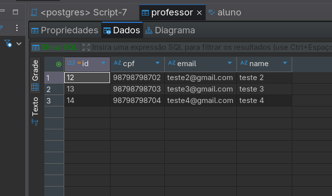
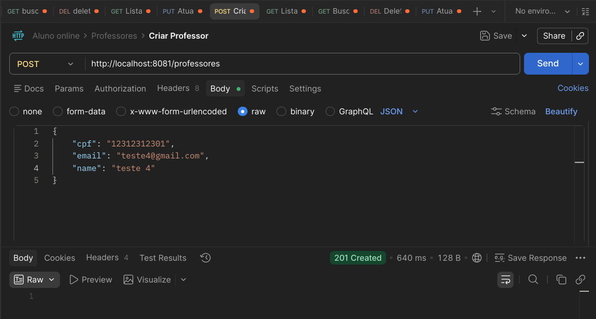
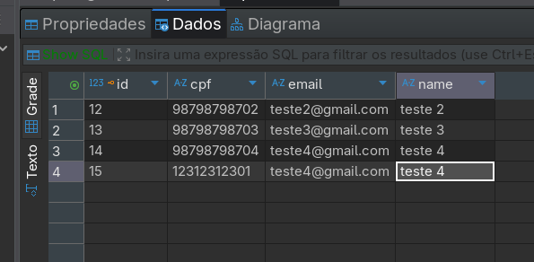
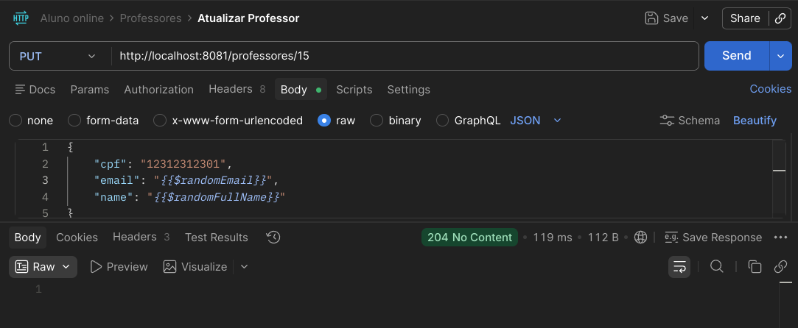
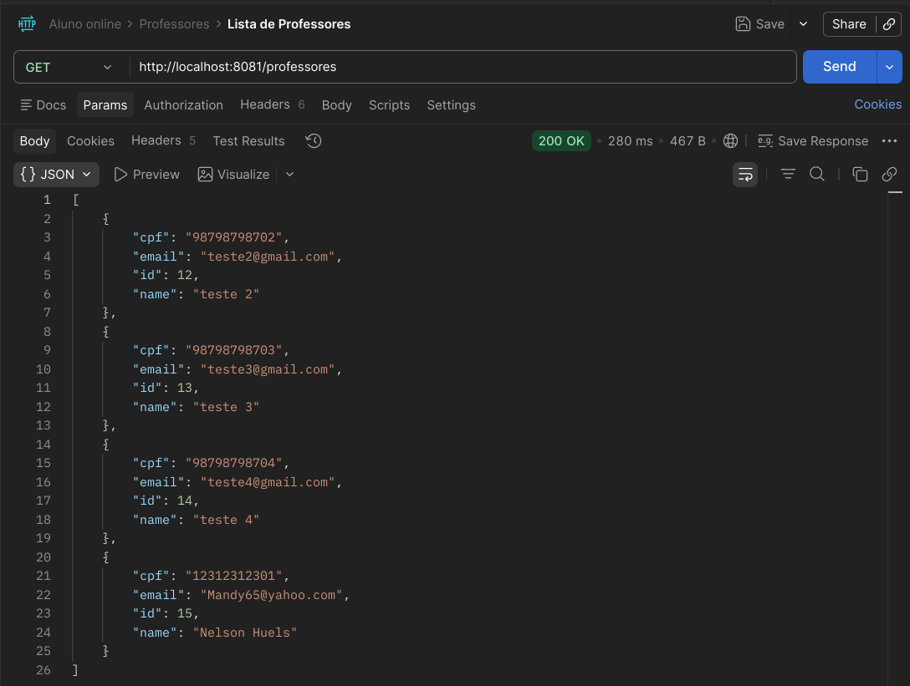

# Aluno Online - API Backend 🎓

Bem-vindo ao **Aluno Online**, uma API REST robusta desenvolvida para simplificar o gerenciamento acadêmico. Este sistema permite o controle centralizado de alunos e professores, servindo como base para plataformas de educação e portais acadêmicos.

---

## 📖 Sobre o Projeto

O **Aluno Online** nasceu da necessidade de um sistema backend eficiente que pudesse escalar conforme a demanda de uma instituição de ensino. O foco principal é fornecer uma interface clara para operações de CRUD, garantindo a integridade dos dados e seguindo padrões de arquitetura modernos da indústria Java.

### Objetivos Principais:
- Facilitar o registro e manutenção de dados de **Alunos** e **Professores**.
- Demonstrar o uso de **Arquitetura em Camadas** com o ecossistema Spring.
- Implementar **Validação de Dados** rigorosa para prevenir inconsistências no banco de dados.

---

## 🛠️ Tecnologias Utilizadas

O projeto utiliza o estado da arte do ecossistema Java:

- **Linguagem:** [Java 21](https://www.oracle.com/java/technologies/downloads/) (LTS)
- **Framework:** [Spring Boot 4.x](https://spring.io/projects/spring-boot)
- **Persistência:** Spring Data JPA + Hibernate
- **Banco de Dados:** PostgreSQL
- **Utilitários:** 
  - [Lombok](https://projectlombok.org/): Redução de código boilerplate.
  - [Jakarta Bean Validation](https://beanvalidation.org/): Validação de contratos (DTOs).
- **Gerenciador de Dependências:** Maven

---

## 📐 Arquitetura do Sistema

O sistema segue o padrão de **Arquitetura em Camadas**, garantindo o desacoplamento e a facilidade de testes:

1.  **Controller (Exposição):** Camada de entrada que recebe as requisições HTTP e valida os dados de entrada via DTOs.
2.  **DTOs (Contratos):** Objetos de Transferência de Dados que definem o que é visível e editável pela API.
3.  **Service (Lógica de Negócio):** Onde as regras do sistema residem. Faz o mapeamento entre DTOs e Entidades.
4.  **Repository (Persistência):** Camada de abstração do banco de dados utilizando Spring Data JPA.
5.  **Model/Entity (Banco de Dados):** Representação das tabelas físicas no banco PostgreSQL.

---

## 📂 Detalhamento do Código

### Estrutura de Pastas
```text
src/main/java/br/com/alunoonline/api/
├── controller/ # Handlers dos endpoints REST
├── service/    # Lógica de negócio e mapeamento
├── repository/ # Interfaces de acesso ao banco
├── model/      # Entidades do Banco de Dados
└── dtos/       # Contratos de entrada e validação (Bean Validation)
```

### Funcionalidades Implementadas
- **Aluno:** CRUD completo com persistência direta.
- **Professor:** CRUD completo utilizando DTOs para proteção da entidade e validação via `@Valid`.

---

## 📖 Documentação da API

### 👨‍🎓 Alunos (`/alunos`)

| Método | Endpoint | Descrição |
| :--- | :--- | :--- |
| `POST` | `/alunos` | Cadastra um novo aluno |
| `GET` | `/alunos` | Retorna lista de todos os alunos |
| `GET` | `/alunos/{id}` | Busca aluno por identificador único |
| `PUT` | `/alunos/{id}` | Atualiza dados de um aluno |
| `DELETE` | `/alunos/{id}` | Exclui registro de um aluno |

### 👨‍🏫 Professores (`/professores`)

| Método | Endpoint | Descrição |
| :--- | :--- | :--- |
| `POST` | `/professores` | Cadastra um professor (Valida e-mail e campos brancos) |
| `GET` | `/professores` | Retorna lista de todos os professores |
| `GET` | `/professores/{id}` | Busca professor por identificador único |
| `PUT` | `/professores/{id}` | Atualiza dados (com re-validação dos campos) |
| `DELETE` | `/professores/{id}` | Exclui registro de um professor |

---

## 📸 Demonstração (Imagens do Sistema)

Nesta seção, você pode ver o funcionamento da API na prática, desde as requisições no Insomnia até a persistência no banco de dados via DBeaver.

### 1. Estado Inicial do Banco de Dados
Abaixo, a tabela de **Professores** no DBeaver antes das operações de teste.


### 2. Criando um Novo Professor (POST)
Exemplo de uma requisição `POST` realizada no Insomnia para cadastrar um novo professor com validação de DTO.


### 3. Verificação de Dados no DBeaver
Após o cadastro, podemos ver o novo registro inserido corretamente no PostgreSQL.


### 4. Atualização de Registro (PUT)
Realizando a atualização dos dados de um professor existente.


### 5. Resultado Final e Busca por ID (GET)
Verificando a alteração no banco e realizando uma busca individual por ID.


---

## 🚀 Como Rodar o Projeto

1. Clone o repositório.
2. Crie um banco PostgreSQL chamado `aluno-online`.
3. Configure `application.properties` com suas credenciais.
4. Execute `mvn spring-boot:run`.
